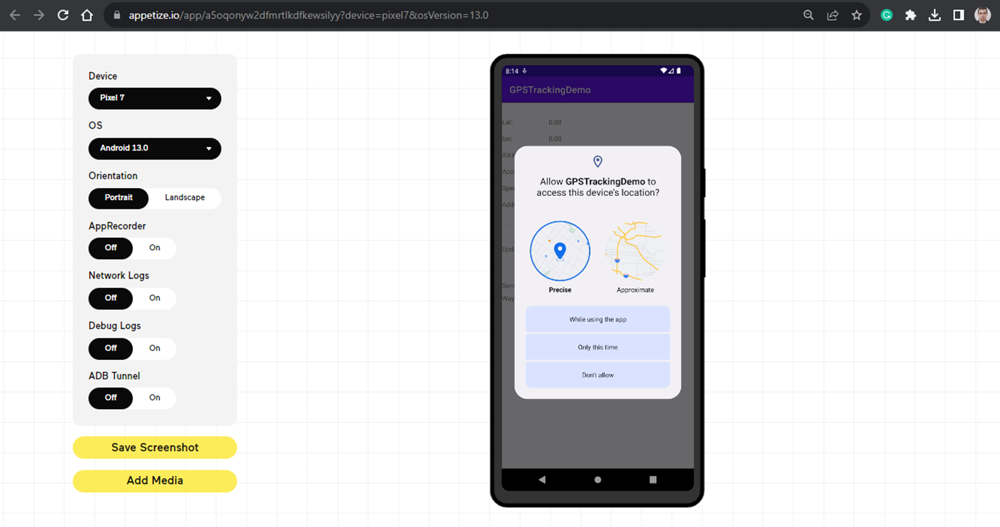
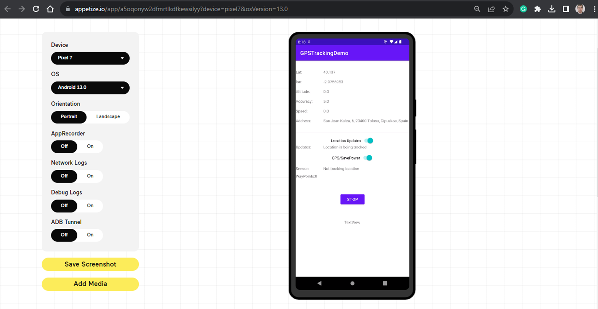

# SPACEFORGREEN Mobile application

## Step1: Basic test of Android APK generation from GitLab

Basic test using: https://appetize.io/




## Step2: How to add python chaquopy library

Chaquopy is distributed as a plugin for Android’s Gradle-based build system.

1. In your top-level `build.gradle` file, set the Chaquopy version:

    ```console
    plugins {
        id 'com.chaquo.python' version '13.0.0' apply false
    }
    ```

2. In the module-level `build.gradle` file (usually in the app directory), apply the Chaquopy plugin after the Android plugin:

    ```console
    plugins {
        id 'com.chaquo.python'
    }
    ```

3. The Python interpreter is a native component, so you must use the abiFilters setting to specify which ABIs you want the app to support. In the module-level `build.gradle` file (usually in the app directory), apply the ABI filter inside of the `Android` plugin:

    ```console
    android {
        ...
        defaultConfig {
            ndk {
                abiFilters "armeabi-v7a", "arm64-v8a", "x86", "x86_64"
            }
        }
        ...
    }
    ```

4. Set `buildPython`. In the module-level `build.gradle` file (usually in the app directory), apply the `buildPython` inside of the `Android` plugin:

    ```console
    android {
        ...
        python {
            buildPython "python"
        }
        ...
    }
    ```

5. Add source code. To include *Python* source code from other directories, use the `android.sourceSets` block. In the module-level `build.gradle` file (usually in the app directory), apply the `sourceSets` inside of the `Android` plugin:

    ```console
    android {
        ...
        sourceSets {
            main {
                python.srcDir "src/main/python"
            }
        }
        ...
    }
    ```

6. Set startup. If the app always uses Python, then call Python.start() from a location which is guaranteed to run exactly once per process, such as Application.onCreate(). Simply add the following attribute to the `<application>` element in `AndroidManifest.xml`:

    ```console
    android:name="com.chaquo.python.android.PyApplication"
    ```
